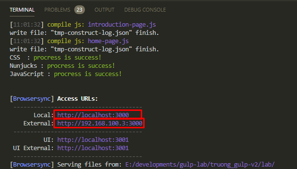

# G-Lax (Relax with Gulp)

### Introdution:
You know about Gulp ? The module bundler for patterns and technicals [[more information]](https://gulpjs.com/)
You're using Webpack / Rollup ... to create a Frontend static module bundler system, That's the best choice. But have you wondered what happend going when you make it with Gulp ? hmmm ... Why not ?

So today, we'll relax with gulp to see how Gulp work as a bundler for (Nunjuck, Sass, Javascript, Vue). Let's go !!!

#### Step 1
You need pull the project GLax from [[gitlab]]()

#### Step 2
Go to <mark>glax</mark> folder run <mark>npm install</mark>

#### Step 3
Open your coding editor, at terminal panel, try typing <mark>npm run dev:temp</mark> wait a moment, and then you'll see finish message with lightgreen color
- Click to <mark>http://localhost:xxx</mark> to open product webpage in local
- Click to <mark>http://x.x.x.x:xxx</mark> to open product webpage in external local, and you can use this address id to open in your smartphone browser
 

<u>NOTE</u>
Beside the <mark>npm run dev:temp</mark> syntax, often use to build project in dev enviroment (with template Nunjuck), You can use another syntax to build project just in dev but without template (Only css and js) or production enviroment.

- <mark>npm run dev</mark> - build project in dev enviroment without template.
- <mark>npm run prod</mark> - build project in production enviroment.

And...Finish ! Just a few step, you can see the total view of how G-Lax project bundler work. But if you want to create project of yourself with G-Lax, then you can readmore about the structure static folders and files below.

### Nunjuck structure (you can refer to demo of home-page template) [[Nunjuck]](https://mozilla.github.io/nunjucks/)

src
|__ njk
 &nbsp;&nbsp;&nbsp;&nbsp;&nbsp;&nbsp;|__ <mark>_layout.njk</mark> (A standard form to render HTML)
 &nbsp;&nbsp;&nbsp;&nbsp;&nbsp;&nbsp;|__ <mark>_demo.nj</mark> (A Demo file will teach you how to create template with nunjuck at basic)
 &nbsp;&nbsp;&nbsp;&nbsp;&nbsp;&nbsp;|__ <mark>template</mark> (A folder that include files used to create special layouts)
 &nbsp;&nbsp;&nbsp;&nbsp;&nbsp;&nbsp;|__ <mark>partial</mark> (A folder that include files used to create special sections for each template)
 &nbsp;&nbsp;&nbsp;&nbsp;&nbsp;&nbsp;|__ <mark>component</mark> (A folder that include files used to create global component for each template / section)

### Sass structure (you can refer to demo of home-page partial) [[Sass]](https://sass-lang.com/)

src
|__ scss
 &nbsp;&nbsp;&nbsp;&nbsp;&nbsp;&nbsp;|__ <mark>vendor.scss</mark> (A file that include <mark>_base.scss</mark> and global style)
 &nbsp;&nbsp;&nbsp;&nbsp;&nbsp;&nbsp;|__ <mark>_var.scss</mark> (A file that include general variables for style)
 &nbsp;&nbsp;&nbsp;&nbsp;&nbsp;&nbsp;|__ <mark>_base.scss</mark> (A file that include all of basic style)
 &nbsp;&nbsp;&nbsp;&nbsp;&nbsp;&nbsp;|__ <mark>var</mark> (A folder that include special variable files)
 &nbsp;&nbsp;&nbsp;&nbsp;&nbsp;&nbsp;|__ <mark>partial</mark> (A folder that include special style files used to create global component for each template / section)
 &nbsp;&nbsp;&nbsp;&nbsp;&nbsp;&nbsp;|__ <mark>mixin</mark> (A folder that include [mixin](https://sass-lang.com/documentation/at-rules/mixin) files of sass)
 &nbsp;&nbsp;&nbsp;&nbsp;&nbsp;&nbsp;|__ <mark>function</mark> (A folder that include [function](https://sass-lang.com/documentation/at-rules/function) files of sass)
 &nbsp;&nbsp;&nbsp;&nbsp;&nbsp;&nbsp;|__ <mark>lib</mark> (A folder that include lib files of the third party)
 &nbsp;&nbsp;&nbsp;&nbsp;&nbsp;&nbsp;|__ <mark>layout</mark> (A folder that include files that setup basic style for layout)

### Javascript structure (you can refer to demo of home-page partial) [[Javascript]](https://developer.mozilla.org/en-US/docs/Web/JavaScript)

src
|__ js
 &nbsp;&nbsp;&nbsp;&nbsp;&nbsp;&nbsp;|__ <mark>vendor.js</mark> (A file that include all of original init for running javascript of project)
 &nbsp;&nbsp;&nbsp;&nbsp;&nbsp;&nbsp;|__ <mark>partial</mark> (A folder that include javascript and vue files for each special template)
 &nbsp;&nbsp;&nbsp;&nbsp;&nbsp;&nbsp;|__ <mark>lib</mark> (A folder that include javascript files of third party)
 &nbsp;&nbsp;&nbsp;&nbsp;&nbsp;&nbsp;|__ <mark>base</mark> (A folder that include javascript files, which used to define common information)

### DummyData structure

src
|__ dummy-data
 &nbsp;&nbsp;&nbsp;&nbsp;&nbsp;&nbsp;|__ <mark>data-store</mark> (A folder that include all of dummy data files, which used to define dummy data quicky for render process)

---

<u>NOTE</u>
All of structure above are based a few Design System, Design Pattern that you can refer to
- [Nunjuck design layout pattern](https://css-tricks.com/component-led-design-patterns-nunjucks-grunt/?fbclid=IwAR2DQUKbQU73EKzF7fTigl0QPwwtUTaFLUGhW2VLy3IXmazEGZ--dQ-yJE8)
- [Design System for style structure](https://uifreebies.net/blog/12-design-systems-you-must-know)
